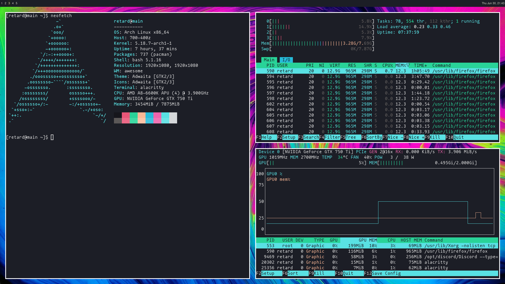

## AwesomeWM

Bare bones tiling window manager config w/ theme.lua

#### Dependancies

* [awesome](https://awesomewm.org/)

  Launched at start:

* [nitrogen](https://github.com/l3ib/nitrogen) gtk based wallpaper setter
* [picom](https://github.com/yshui/picom) compositor
* [pa-applet](https://github.com/fernandotcl/pa-applet) lightweight pulseaudio applet

#### Screenshot

Tiling mode gets window gap/color variables from theme.lua
